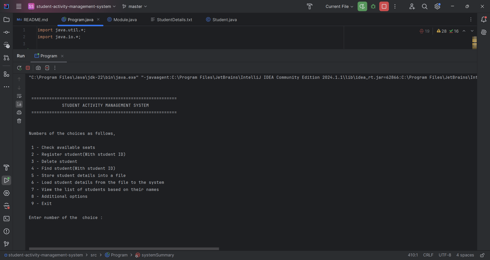
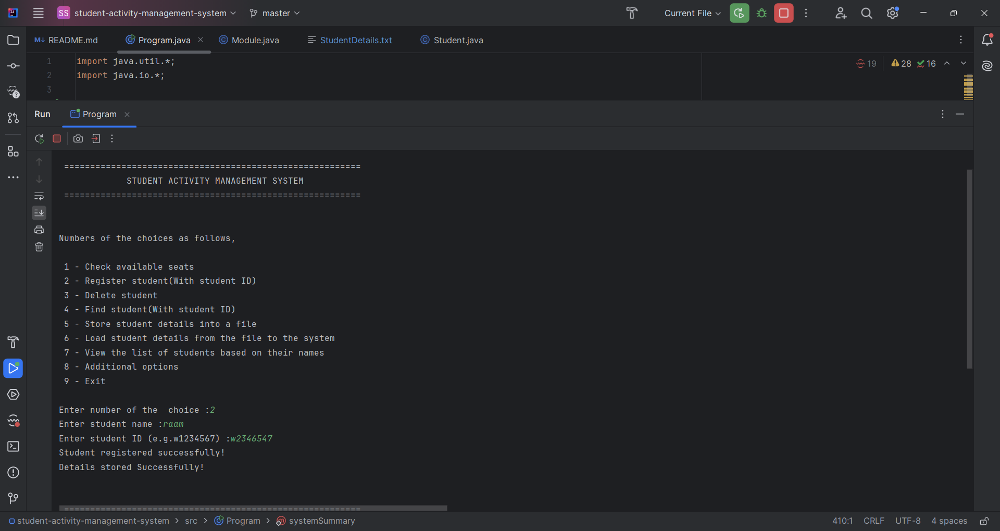
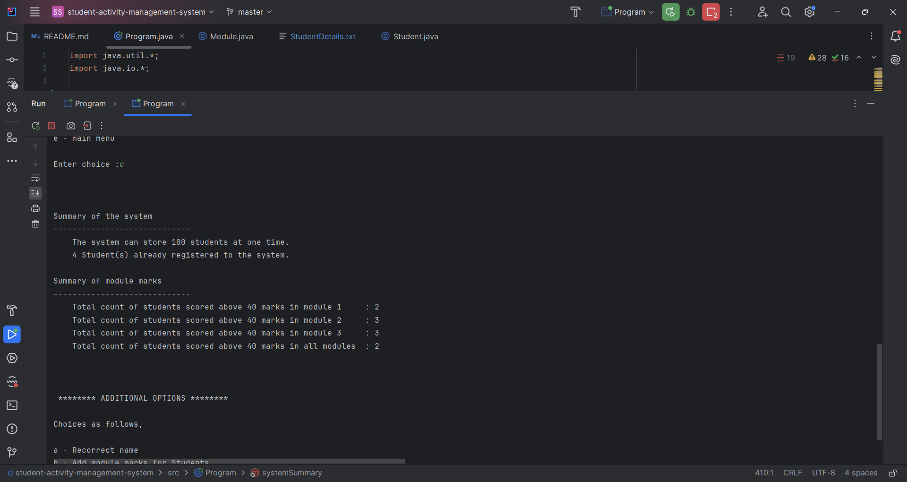
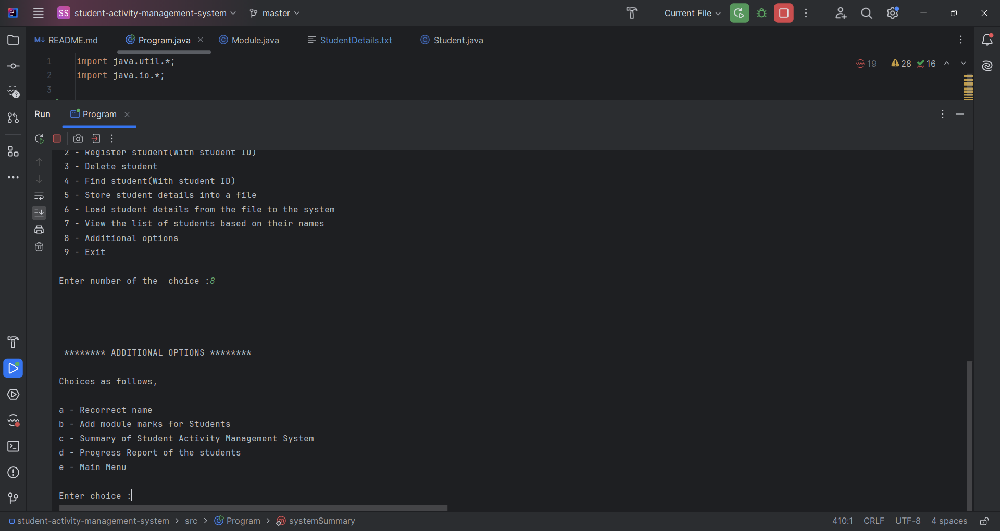
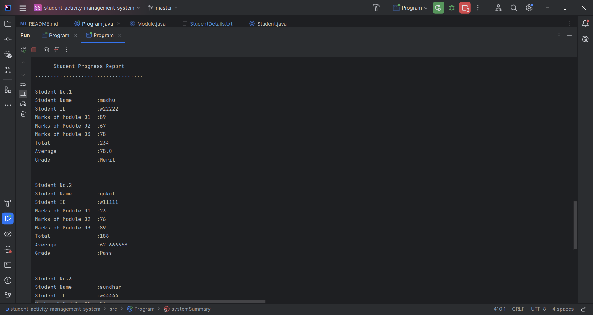

# Student Activity Management System

## 📌 Project Overview
This is a **Java console application** developed as part of the **Software Development II coursework** at the University of Westminster.  
The system is designed to manage student registrations, academic results, and performance for three modules in Semester 1.  

It provides a menu-driven interface that allows university staff to register students, store and load records, manage results, and generate reports.

---

## ✨ Features
- **Student Registration and Management**
  - Register new students (Name + ID).
  - Delete students by ID.
  - Find students by ID.
  - View list of students sorted by name (Bubble Sort).
  - Check available seats (up to 100 students).

- **File Handling**
  - Store student details into a text file.
  - Load student details back into the system.

- **Results Management**
  - Add and update module marks for each student.
  - Automatically calculate total, average, and grade:
    - Distinction (≥80)  
    - Merit (≥70)  
    - Pass (≥40)  
    - Fail (<40)

- **Reports**
  - Generate system summary (registrations and pass counts).
  - Generate detailed student progress reports (sorted by average marks).

- **Testing**
  - Extensive test cases included for validation, file operations, and error handling.

---

## 🛠️ Technologies Used
- **Language**: Java (Console Application)
- **Core Concepts**: Arrays, Classes & Objects, File Handling, Exception Handling, Sorting Algorithms (Bubble Sort)
- **IDE**: IntelliJ IDEA

---

## 📂 Project Structure
```
.
├── Program.java # Main program with menu options
├── Student.java # Student class (name, ID, module marks)
├── Module.java # Module class (marks, total, average, grade)
├── StudentDetails.txt # File to store and load student details
└── README.md # Project documentation
```

---

## ▶️ How to Run
1. Open the project in **IntelliJ IDEA** (or any Java IDE).
2. Make sure a valid **JDK** is configured (Java 8 or later recommended).
3. Compile and run `Program.java`.
4. Use the menu displayed in the console to interact with the system:
   - `1` → Check available seats  
   - `2` → Register student  
   - `3` → Delete student  
   - `4` → Find student  
   - `5` → Store student details into file  
   - `6` → Load student details from file  
   - `7` → View student list (sorted by name)  
   - `8` → Additional options (marks, reports)  
   - `9` → Exit  

---

## 📸 Screenshots
Here are some example screenshots of the system running in the console:

### Main Menu


### Student Registration


### System Summary


### Additional Options Menu


### Student Progress Report


---

## 🧪 Testing
- The system was tested using **33 test cases** covering:
  - Input validation
  - Registration, deletion, and finding students
  - File operations (store/load)
  - Sorting correctness
  - Report generation
- All test cases passed successfully ✅

---

## 📖 References
- Weekly lecture materials and tutorials  
- [w3schools](https://www.w3schools.com)  
- [GeeksforGeeks](https://www.geeksforgeeks.org)  
- YouTube (Error Makes Clever Academy, Bro Code, Code.io)

---

